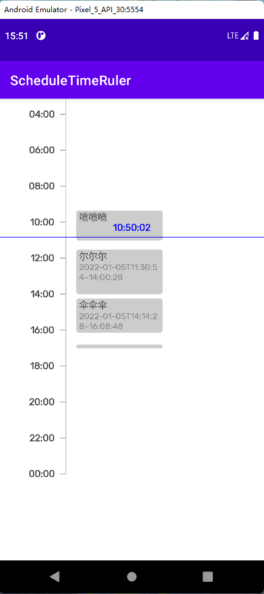

## ScheduleTimeRulerView

### DEMO

+ 观看演示 [DEMO-VIDEO](https://www.bilibili.com/video/BV1eS4y1T7KV?share_source=copy_web)
+ 截图 

 

### 使用
To get a Git project into your build:

Step 1. Add the JitPack repository to your build file

Add it in your root build.gradle at the end of repositories:

	allprojects {
		repositories {
			...
			maven { url 'https://jitpack.io' }
		}
	}
  
Step 2. Add the dependency

	dependencies {
	        implementation "com.github.mcxinyu:ScheduleTimeRuler:{last-version}"
	}

### 组件
#### TimeRulerView

+ 时间尺

#### ScaleTimeRulerView

+ 带缩放功能的时间尺

#### ScheduleTimeRulerView

+ 带计划事件的缩放功能的时间尺

### proguard-rules.pro

	此库自带混淆规则，并且会自动导入，正常情况下无需手动导入。

### 参考

+ [TimeRuler](https://github.com/Liberations/TimeRuler)
